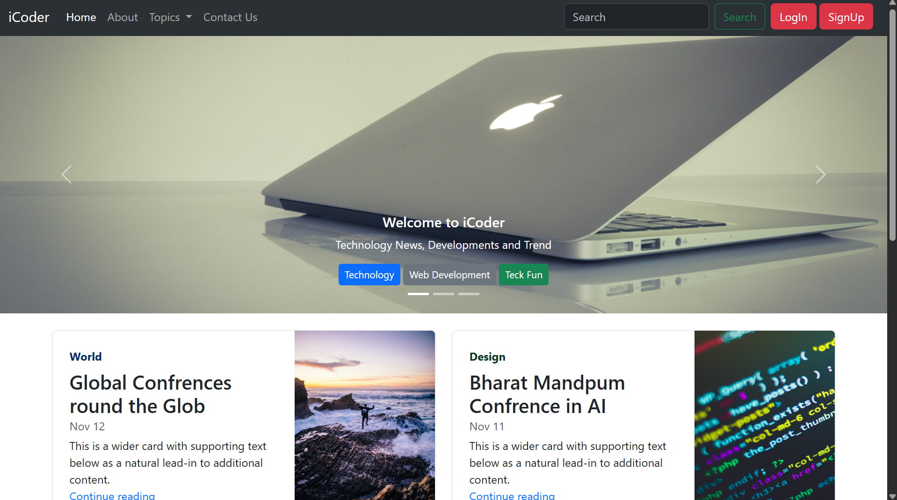
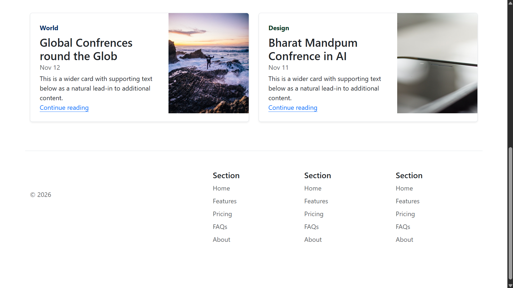
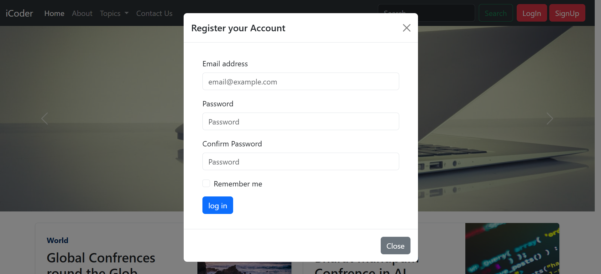
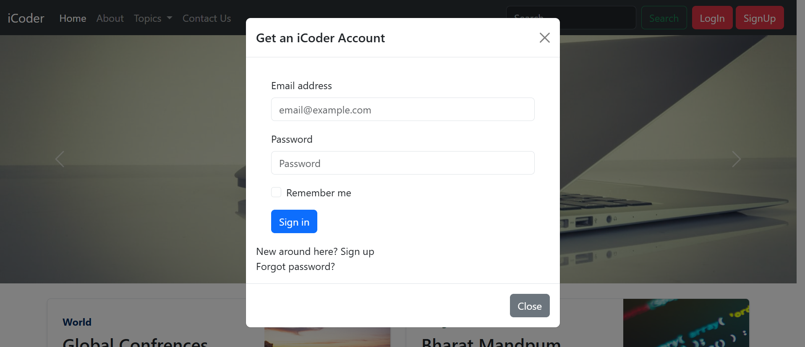

# 💻 iCoder - Responsive Bootstrap Website

A modern, fully responsive **multi-page website** built using **Bootstrap 5**, HTML5, and Bootstrap components. This project demonstrates responsive web design principles, navigation, forms, cards, and reusable Bootstrap layouts.

It is designed as a beginner-friendly Bootstrap project to practice building responsive websites without writing much custom CSS.

---

## 🚀 Live Demo

🔗 **Website:** https://icoder01.netlify.app/


---

## 📸 Screenshots

### 🏠 Home Page




### ℹ️ Login Page



### ℹ️ SignUp Page



> Replace these images with your own screenshots stored inside the `screenshots/` folder.

---

## ✨ Features

- 📱 Fully Responsive Design
- 🎨 Built with Bootstrap 5
- 🧭 Responsive Navigation Bar
- 📄 Multi-page Website
- 📝 Contact Form
- 📦 Bootstrap Grid System
- 🎯 Jumbotron / Hero Section
- 📚 Cards and Content Sections
- 🔍 Search Bar in Navigation
- ⚡ Mobile-Friendly Layout
- 🖥️ Clean and Beginner-Friendly Code

---

## 🛠️ Technologies Used

- HTML5
- Bootstrap 5.3
- Bootstrap Components
- Bootstrap Grid System
- Responsive Web Design

---

## 📂 Project Structure

```
iCoder/
│
├── images/
│   ├── 1.jpg
│   ├── 2.jpg
│   ├── 3.jpg
│   ├── thumb1.jpg
│   ├── thumb2.jpg
│   └── thumb3.jpg
│
├── screenshots/
│   ├── home1.png
│   ├── home2.png
│   ├── login.png
│   └── signup.png
│
├── index.html
├── about.html
├── contact.html
└── README.md
```

---

## 📑 Website Pages

### 🏠 Home

- Landing Page
- Bootstrap Carousel
- Featured Content
- Responsive Layout

### ℹ️ About

- Hero Section
- AI & Technology Information
- Bootstrap Cards
- Responsive Containers

---

## 📱 Responsive Design

The website is optimized for:

- 💻 Desktop
- 💼 Laptop
- 📱 Mobile
- 📟 Tablet

---

## 🎯 Bootstrap Components Used

- Navbar
- Collapse
- Dropdown Menu
- Carousel
- Grid System
- Container
- Buttons
- Forms
- Cards
- Utilities
- Typography

---

## 🚀 Getting Started

### Clone the Repository

```bash
git clone https://github.com/ayush2008mishra/Bootstrap.icoder
```

### Navigate to the Project

```bash
cd iCoder
```

### Open the Website

Simply open `index.html` in your browser.

Or use the VS Code **Live Server** extension.

---

## 📚 What I Learned

While building this project, I practiced:

- Bootstrap Grid System
- Responsive Layout Design
- Bootstrap Components
- Navigation Bar
- Forms
- Cards
- Bootstrap Utilities
- Multi-page Website Development
- Responsive Web Design

---

## 🤝 Contributing

Contributions, issues, and feature requests are welcome.

If you'd like to improve this project, feel free to fork the repository and submit a pull request.

---

## ⭐ Show Your Support

If you found this project helpful, please consider giving it a ⭐ on GitHub!

---

## 👨‍💻 Author

**Ayush Mishra**

- GitHub: https://github.com/ayush2008mishra/Bootstrap.icoder
- LinkedIn: https://www.linkedin.com/in/ayush-mishra-6b41a9329/

---
